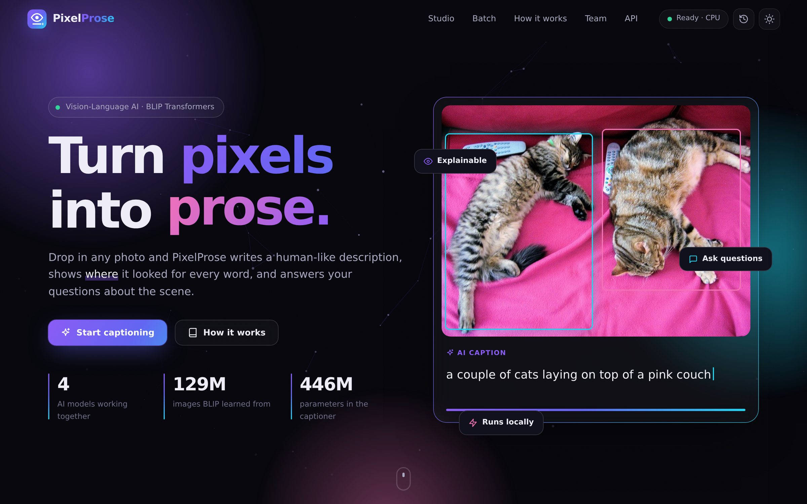
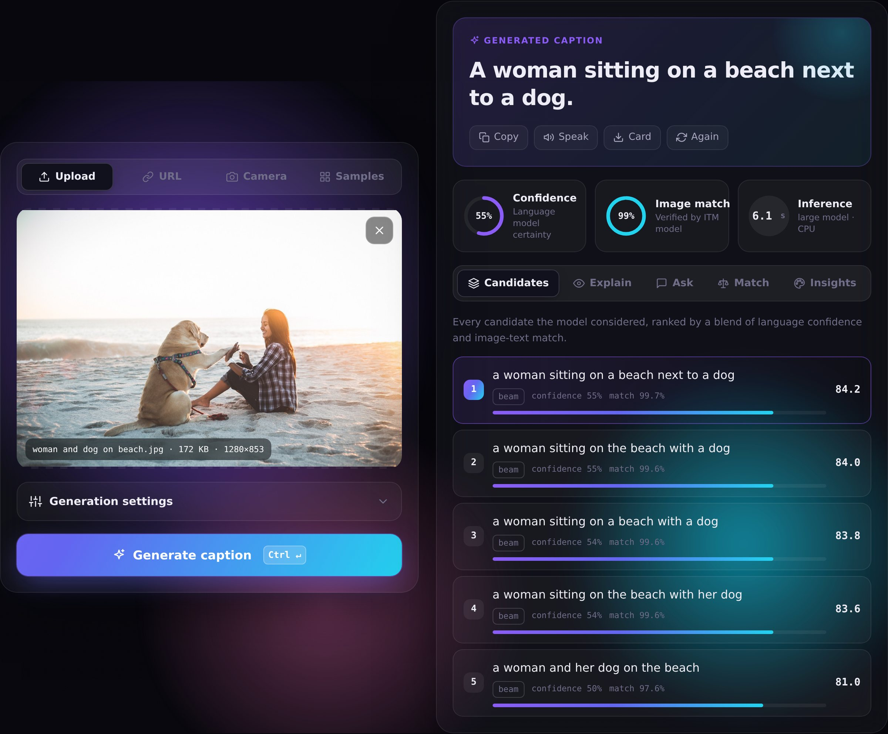
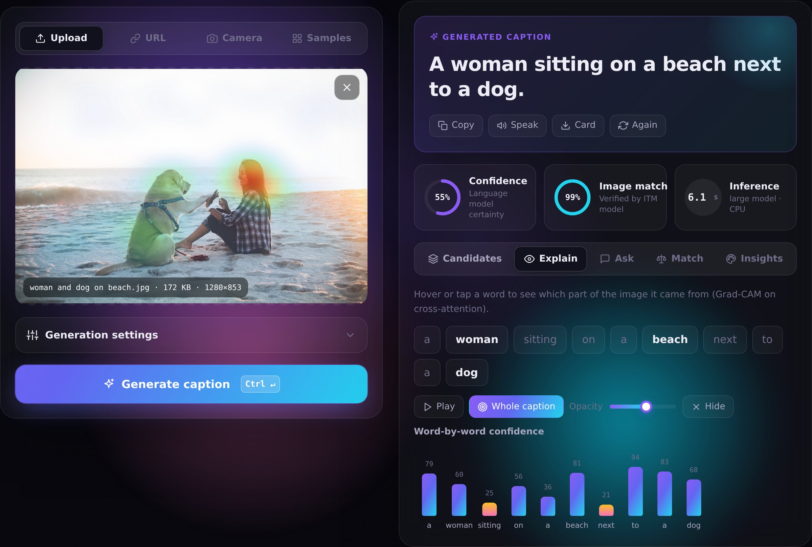
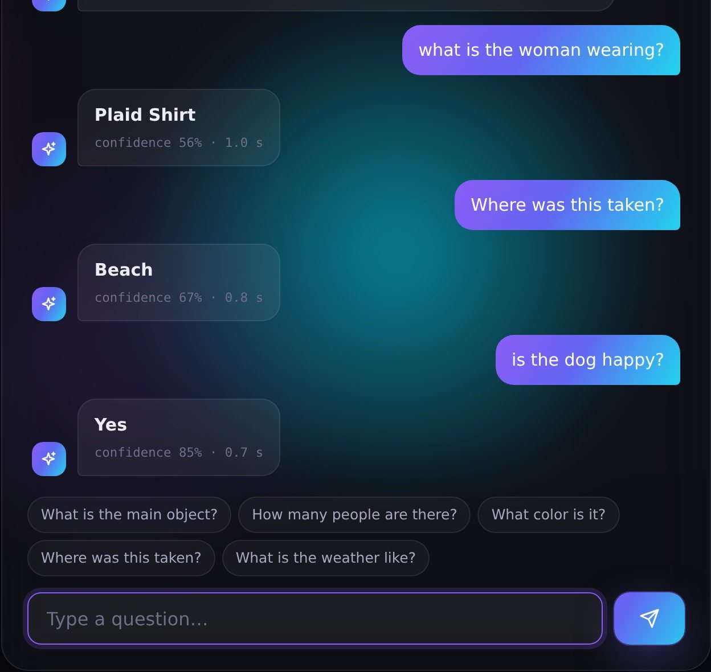
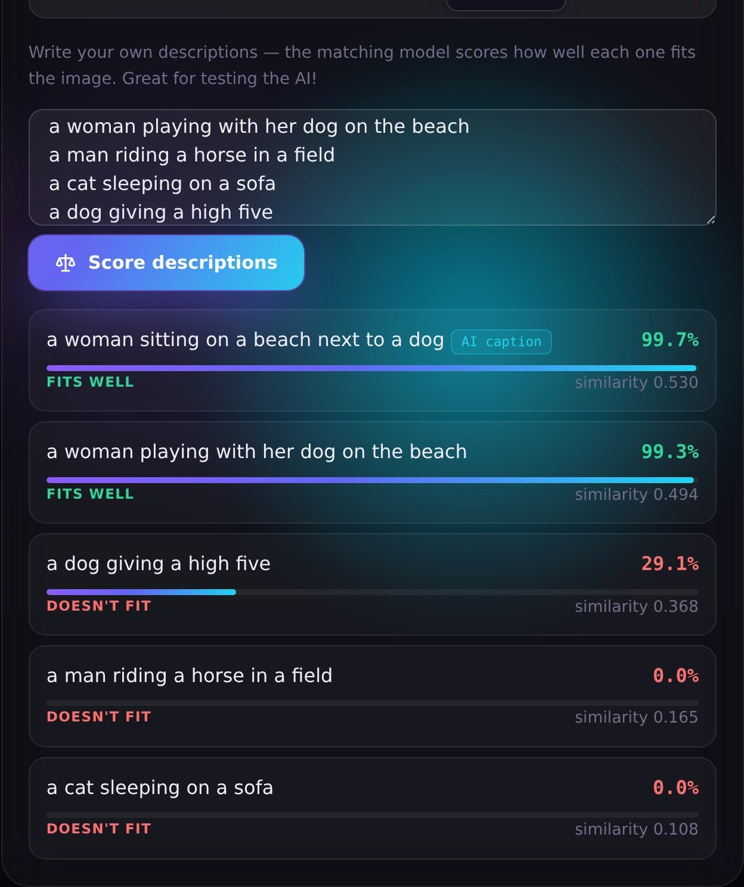

<div align="center">

# PixelProse

### Explainable AI Image Caption Generator

**Turn pixels into prose.** Upload any photo and get a human-like caption. See *where* the AI looked for every word, and ask it questions about the scene. Everything runs locally on your laptop.

*Advanced Artificial Intelligence project · Computer Engineering*
**Kartik Verma · Dhir Thakar · Kushal Soni**



</div>

---

## Highlights

| | |
|---|---|
| **Accurate captions** | Salesforce **BLIP-large** (ViT-L/16, 446M params) with beam search, then **re-ranked by a second model** that checks each sentence against the image |
| **Explainable** | Per-word **Grad-CAM heatmaps** show where the model looked, plus a probability chart for every word |
| **Visual Q&A** | Chat with the image: *“What is the woman wearing?”* → *“plaid shirt”* |
| **Match** | Score any description you type against the image |
| **Measured** | BLEU / ROUGE-L / CIDEr-D benchmark on 44 images with 132 hand-written references, see [EVALUATION.md](docs/EVALUATION.md) |
| **Beautiful UI** | Glassmorphism, dark & light themes, animations, responsive, keyboard shortcuts, accessible |
| **Private & offline** | No cloud API: after a one-time model download it works without internet |

Plus: 5 input methods (upload, drag & drop, paste, URL, webcam) and 44 samples, guided captions, a fast/accurate model switch, keywords & hashtags, colour palette, alt-text HTML, text-to-speech, a shareable caption card, batch mode with CSV/JSON export, history, a REST API with Swagger docs, and a CLI. **[All 22 features →](docs/FEATURES.md)**

<table>
<tr>
<td width="50%"><br/><sub><b>Caption studio</b>: caption, confidence, image-match and ranked candidates</sub></td>
<td width="50%"><br/><sub><b>Explain</b>: Grad-CAM heatmaps and word-by-word confidence</sub></td>
</tr>
<tr>
<td><br/><sub><b>Ask</b>: visual question answering</sub></td>
<td><br/><sub><b>Match</b>: score your own descriptions</sub></td>
</tr>
</table>

---

## Quick start

**Requirements:** Python 3.10+ · 8 GB RAM (16 GB recommended) · ~6 GB free disk · internet for the first run only. A GPU is optional.

### Windows (easiest)
1. Double-click **`setup.bat`**. It creates a virtual environment, installs everything and downloads the models (~4 GB, one time).
2. Double-click **`start.bat`**. The browser opens at **http://127.0.0.1:8000**.

### macOS / Linux
```bash
./setup.sh      # one time
./start.sh      # every time → http://127.0.0.1:8000
```

### Manual
```bash
python -m venv .venv
.venv\Scripts\activate            # Windows   (macOS/Linux: source .venv/bin/activate)
pip install -r requirements.txt
python scripts/download_models.py # optional: pre-download all models
python run.py                     # → http://127.0.0.1:8000
```

Wait for the green **Ready · CPU** pill in the navbar (a few seconds once the models are downloaded), then pick an image and press **Generate caption**. There are test photos in [`sample_images/`](sample_images), also available under the **Samples** tab.

> **Tip for demos:** run `python run.py --host 0.0.0.0` and open `http://<your-laptop-ip>:8000` on a phone on the same Wi-Fi.

---

## How it works

```
Image ─► resize 384×384 ─► ViT-L/16 (576 patches, 24 layers) ─► image embeddings
                                                                    │ cross-attention
           "a picture of" ─► BERT decoder ── beam search (k=5) ────┤
                                                                    ▼
                     candidates ─► token probabilities (confidence)
                                ─► BLIP-ITM re-rank: 0.65·match + 0.35·confidence ─► best caption
                                ─► Grad-CAM on ITM cross-attention ─► per-word heatmaps
```

| Model | Hub id | Role |
|---|---|---|
| BLIP-large captioner | `Salesforce/blip-image-captioning-large` | Default captioner (446M) |
| BLIP-base captioner | `Salesforce/blip-image-captioning-base` | Fast mode (224M) |
| BLIP ITM | `Salesforce/blip-itm-base-coco` | Re-ranking, Match, heatmaps (224M) |
| BLIP VQA | `Salesforce/blip-vqa-base` | Question answering (361M) |

Details: **[Architecture & algorithms](docs/ARCHITECTURE.md)**

### Results (44 images, 4-core CPU)

| Configuration | BLEU-4 | CIDEr-D | Image match | sec/image |
|---|---:|---:|---:|---:|
| BLIP-base, greedy | 0.351 | 1.819 | 94% | 1.0 |
| BLIP-large, greedy | 0.326 | 1.757 | 88% | 2.2 |
| BLIP-large, beam 5 | 0.416 | 1.957 | 88% | 3.2 |
| **PixelProse Balanced (default)** | 0.408 | 1.945 | **92%** | 3.9 |
| PixelProse Detailed | 0.399 | 1.913 | **97%** | 5.6 |

Full analysis: **[EVALUATION.md](docs/EVALUATION.md)**

---

## Other ways to use it

**Command line**
```bash
python cli.py sample_images/animals/zebra.jpg
python cli.py sample_images/food --model base --csv captions.csv
python cli.py photo.jpg --ask "what color is the car?" --prompt "a photo of"
```

**REST API**: interactive docs at **http://127.0.0.1:8000/docs**
```bash
curl -F file=@sample_images/animals/zebra.jpg http://127.0.0.1:8000/api/caption
```
See **[API.md](docs/API.md)** for every endpoint.

---

## Configuration

Copy `.env.example` to `.env` and uncomment what you need. Common options:

| Variable | Default | Meaning |
|---|---|---|
| `DEFAULT_CAPTION_MODEL` | `large` | `base` for older laptops |
| `DEVICE` | `auto` | `cpu`, `cuda` or `mps` |
| `ENABLE_VQA` / `ENABLE_ITM` | `true` | Turn features off to save ~1.5 GB of RAM each |
| `HOST` / `PORT` | `127.0.0.1` / `8000` | Use `0.0.0.0` for LAN access |

### Offline setup (if huggingface.co is blocked)
Some college networks block Hugging Face. Salesforce also hosts the original BLIP checkpoints on Google Cloud Storage, and our converter turns them into ready-to-use folders:
```bash
python scripts/convert_original_blip.py --out models
```
Then point `.env` at the folders (see the bottom of `.env.example`).

---

## Development

```bash
pip install -r requirements-dev.txt
pytest                         # 35 tests, models mocked, ~5 s
python scripts/evaluate.py     # benchmark (~20 min on CPU)
```

The presentation is generated from code: `cd presentation && npm install && node build_deck.js`.

## Project structure

```
app/            FastAPI backend: config, routes, services (captioner, matcher, vqa, metrics…)
static/         Web interface: index.html, css/styles.css, js/ modules
scripts/        download_models · convert_original_blip · evaluate
sample_images/  44 test images in 6 categories + references.json
tests/          pytest suite
docs/           FEATURES · ARCHITECTURE · API · EVALUATION · PRESENTATION_GUIDE
presentation/   PixelProse_Presentation.pptx (with speaker notes) + generator
reports/        evaluation.json (benchmark output)
```

## Documentation

| Document | What's inside |
|---|---|
| [FEATURES.md](docs/FEATURES.md) | Every feature: what, how, where in the code, demo tips |
| [ARCHITECTURE.md](docs/ARCHITECTURE.md) | System design, request lifecycle, algorithms, performance, security |
| [EVALUATION.md](docs/EVALUATION.md) | Benchmark method, results, examples, limitations |
| [API.md](docs/API.md) | REST endpoints with examples |
| [PRESENTATION_GUIDE.md](docs/PRESENTATION_GUIDE.md) | Speaker split, slide-by-slide script, demo run-sheet, viva Q&A |
| [presentation/](presentation) | The 17-slide deck, with the script in the speaker notes |

## Troubleshooting

| Problem | Fix |
|---|---|
| Pill stays on “Loading AI model…” | The first run downloads ~4 GB, so watch the terminal. Later starts take seconds. |
| “The AI model could not be loaded” | No internet on first run, or Hugging Face is blocked: see *Offline setup* |
| Captions are slow | Use the **Base** model, close heavy apps, keep the laptop plugged in |
| Out of memory | `ENABLE_VQA=false` and/or `DEFAULT_CAPTION_MODEL=base` in `.env` |
| Camera doesn't start | Browsers only allow cameras on `localhost`/HTTPS, so open `http://127.0.0.1:8000` |

## Credits

- **BLIP**: J. Li, D. Li, C. Xiong, S. Hoi. *BLIP: Bootstrapping Language-Image Pre-training for Unified Vision-Language Understanding and Generation.* ICML 2022. Models © Salesforce, BSD-3-Clause.
- **Grad-CAM**: R. R. Selvaraju et al., ICCV 2017.
- **CIDEr**: R. Vedantam et al., CVPR 2015 · **BLEU**: K. Papineni et al., ACL 2002 · **ROUGE**: C.-Y. Lin, 2004.
- Sample images come from public test-image collections of open-source projects (TensorFlow, PyTorch, OpenCV, Darknet, Ultralytics, Hugging Face, Salesforce LAVIS/BLIP) and an ImageNet sample set, and are used here for testing only.
- Built with PyTorch, Hugging Face Transformers, FastAPI and plain HTML/CSS/JavaScript.
