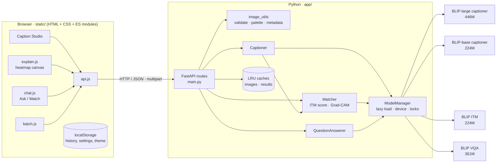

# PixelProse — Architecture & Algorithms

## 1. System overview



| Layer | Technology | Responsibility |
|---|---|---|
| Frontend | Vanilla HTML/CSS/JS (ES modules, no build step) | Input, rendering, animations, heatmaps, history |
| API | FastAPI + Uvicorn | Validation, routing, caching, error handling, OpenAPI docs |
| Services | Python modules in `app/services/` | Captioning, matching, grounding, VQA, image analysis, metrics |
| Models | PyTorch + Hugging Face `transformers` | Four pre-trained BLIP networks |

## 2. Project layout

```
AAI/
├── run.py                   # start the web app
├── cli.py                   # terminal captioning tool
├── app/
│   ├── config.py            # settings from env / .env
│   ├── main.py              # FastAPI app + routes + static hosting
│   ├── schemas.py           # Pydantic request models
│   └── services/
│       ├── model_manager.py # lazy, thread-safe model loading; device & thread policy
│       ├── captioner.py     # encode once → beam + sampling → scoring → re-rank
│       ├── matcher.py       # ITM/ITC scores + Grad-CAM grounding
│       ├── vqa.py           # visual question answering
│       ├── image_utils.py   # safe loading, URL fetch, palette, metadata
│       ├── text_utils.py    # caption cleanup, keywords, hashtags, alt-text
│       ├── metrics.py       # BLEU, ROUGE-L, CIDEr-D
│       └── store.py         # thread-safe LRU cache
├── static/                  # the single-page web app
│   ├── index.html
│   ├── css/styles.css       # design tokens, components, motion, responsive
│   └── js/                  # main, api, ui, effects, studio, explain, chat, batch, history, camera, card, status
├── scripts/
│   ├── download_models.py   # pre-fetch all models before a demo
│   ├── convert_original_blip.py  # offline fallback from Salesforce checkpoints
│   └── evaluate.py          # benchmark
├── sample_images/           # 44 test images + references.json
├── tests/                   # pytest suite (models mocked)
├── docs/                    # this documentation
└── presentation/            # slide deck + generator
```

## 3. Request lifecycle: `POST /api/caption`

1. **Resolve image**: take the multipart file, a URL (downloaded server-side with SSRF checks) or an `image_id` from the LRU image store.
2. **Load & sanitise**: Pillow decodes it, applies EXIF rotation, flattens transparency onto white and downscales it to at most 1600 px. A SHA-1 of the bytes becomes the `image_id`.
3. **Cache check**: beam-search (Balanced) results are deterministic, so `(image_id, options)` is looked up in the result cache. Modes that sample are never cached because they are random on purpose.
4. **Captioner** (under the model lock):
   1. `BlipProcessor` resizes to 384×384 (bicubic) and normalises with CLIP mean/std.
   2. **ViT-L/16** produces `image_embeds` of shape `[1, 577, 1024]`.
   3. Prompt ids `[DEC] a picture of` are prepared exactly as `BlipForConditionalGeneration.generate` does.
   4. `text_decoder.generate(...)` runs on those same embeddings: beam search (Balanced), plus nucleus sampling in Detailed mode.
   5. Candidates are cleaned and de-duplicated, then scored in **one batched teacher-forced pass**.
5. **Re-rank** with ITM (separate lock), blending the scores.
6. **Post-process**: sentence case, keywords, hashtags, alt-text, palette, metadata, timings.
7. The JSON response is gzip-compressed if it is large.

The frontend then fires `POST /api/explain` in the background, so the heatmaps are ready by the time the user opens the Explain tab.

## 4. Models

| Key | Hub id | Architecture | Params | Used for |
|---|---|---|---|---|
| `caption-large` | `Salesforce/blip-image-captioning-large` | ViT-L/16 + BERT decoder | 446M | Default captioner |
| `caption-base` | `Salesforce/blip-image-captioning-base` | ViT-B/16 + BERT decoder | ~224M | Fast mode |
| `itm` | `Salesforce/blip-itm-base-coco` | ViT-B/16 + BERT encoder + ITM head + projections | 224M | Re-ranking, Match, Grad-CAM |
| `vqa` | `Salesforce/blip-vqa-base` | ViT-B/16 + BERT encoder + BERT decoder | 361M | Ask tab |

**Why BLIP?** It is the best-studied open captioning family that still runs on a student laptop's CPU. BLIP-2 and modern VLMs (LLaVA, Florence-2, Qwen-VL) produce richer text but need 2–30× more memory or a GPU. BLIP's pre-training also comes with an **ITM head**, which is what makes self-verification and Grad-CAM possible without extra training. Pre-training on 129M image-text pairs, cleaned by *CapFilt* (a captioner writes synthetic captions and a filter removes noisy ones), is why it generalises so well.

## 5. Algorithms in detail

### 5.1 Beam search
Keep the `k` highest-scoring partial sequences. At each step, expand every beam by every vocabulary token, score by cumulative log-probability (length-normalised), keep the top `k`, and stop at `[SEP]`. We return several beams as candidates.

### 5.2 Nucleus (top-p) sampling
At each step, sort tokens by probability, keep the smallest set whose cumulative probability is at least `p` (0.9), renormalise and sample. Temperature `T` sharpens (T<1) or flattens (T>1) the distribution first.

### 5.3 Candidate scoring
For candidate tokens `w₁…wₙ` (generated part only, including `[SEP]`):

```
confidence = exp( (1/n) · Σ log P(wᵢ | w<ᵢ, image) )      (= 1 / perplexity)
score      = 0.65 · P_ITM(match | image, caption) + 0.35 · confidence
```

### 5.4 Grad-CAM on cross-attention
Let `A ∈ ℝ^{H×T×577}` be layer-8 cross-attention of the ITM text encoder (H heads, T tokens) and `s` the ITM "match" logit.

```
G      = ∂s / ∂A
CAM_t  = mean_h ( A[h, t, 1:] ⊙ ReLU(G[h, t, 1:]) )  → reshape 24 × 24
```

Each map is min-max normalised, rounded to 3 decimals (≈ 5 KB of JSON per caption) and rendered client-side.

### 5.5 Metrics
BLEU (n-gram precision with brevity penalty), ROUGE-L (LCS F-score, β = 1.2) and CIDEr-D (TF-IDF n-gram cosine similarity with clipping and a Gaussian length penalty, σ = 6, ×10). They follow the COCO caption toolkit definitions (`app/services/metrics.py`).

## 6. Concurrency & performance

- `ModelManager` loads each model once, under a per-model load lock (double-checked).
- **CPU:** all models share one re-entrant lock and PyTorch uses `cores − 1` threads. PyTorch's worker threads spin-wait, so if another process (the browser's compositor during our animations) takes one core, the whole thread pool stalls. We measured one caption slowing from ~5 s to >90 s. Leaving a core free fixed it.
- **GPU:** per-model locks and FP16 weights.
- FastAPI `def` endpoints run in a thread pool, so the event loop (static files, health checks) stays responsive while a caption is being generated.

## 7. Configuration

All settings come from environment variables or `.env` (see `.env.example`): model sources, default model, device, preload, feature toggles, thread count, host/port, upload and batch limits, cache size.

## 8. Security considerations

| Risk | Mitigation |
|---|---|
| Huge / malicious images | 15 MB limit, Pillow decompression-bomb limit (80 MP), format allow-list |
| SSRF via URL input | http/https only; DNS-resolved IPs must be public; re-checked after redirects |
| Oversized inputs | Pydantic limits on text lengths, candidate counts and batch sizes |
| XSS | All user or model text inserted into HTML is escaped (`escapeHtml`) |
| Exposure | Binds to `127.0.0.1` by default; `HOST=0.0.0.0` must be chosen explicitly |
